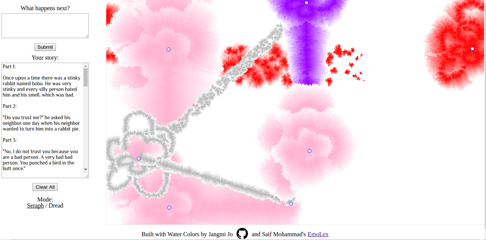

## Colortale

Live link [here!](https://angrobertsh.github.io/colortale/)

### Background

Colortale is a storytelling visualization webpage where users will input short story fragments into a visual interface and from it will come a picture. Using an academically sourced lexicon, lines of different colors and thicknesses are drawn between different fragments inside a canvas so that users will have a unique piece of art to show the emotional flow of their story.

The story content processing will be done by <a href="http://saifmohammad.com/WebPages/NRC-Emotion-Lexicon.htm">Mohammad Saif's crowdsourced lexicon</a>, and pictures will be drawn using <a href="https://github.com/evdel720/watercolor">Jangmi Jo's Water Colors API</a>.

### Technologies

This website was made entirely with HTML, CSS, and JavaScript. There are two main components, the lexicon processing logic, and the canvas and display logic.

Lines and flowers are drawn and modified by an entropy variable. The higher the entropy, the more erratic the lines and the larger the flower's bloom.

```JavaScript
for(let j = 0; j < distance; j++){
  plusminus = ((Math.floor(Math.random()*2))*2)-1;
  linearray.push([Math.floor(x1+(xincrement*j)), (Math.floor(y1+(yincrement*j)+(Math.random()*entropy))*plusminus)]);
}
 ```

This entropy variable was designed by taking a percentage of the total text that includes emotional words, which are designated by mapping over the input text with a dictionary hash, whose keys are words and whose values are arrays corresponding to what emotions they evoke.

```JavaScript
let text = document.getElementById("currentnote").value
let processArray = text.replace(/[.,\/#!$%\^&\*;:{}=\-_`~()"']/g,"").replace(/\s{2,}/g," ").split(" ");

processArray.forEach((word) => {
  if(myDictionary[word]){
    wordEmotions = myDictionary[word];
    wordEmotions.forEach((emo, idx, arr) =>{
      sumEmotions[idx] += arr[idx];
    })
  }
});
```

The end result is a picture formed with lines and blooms!



###Future Directions for the Project

Future directions for this project include elaborating upon the variation in the line between points to create a randomized curve instead, color grading between points, and the ability to save images with stories.
